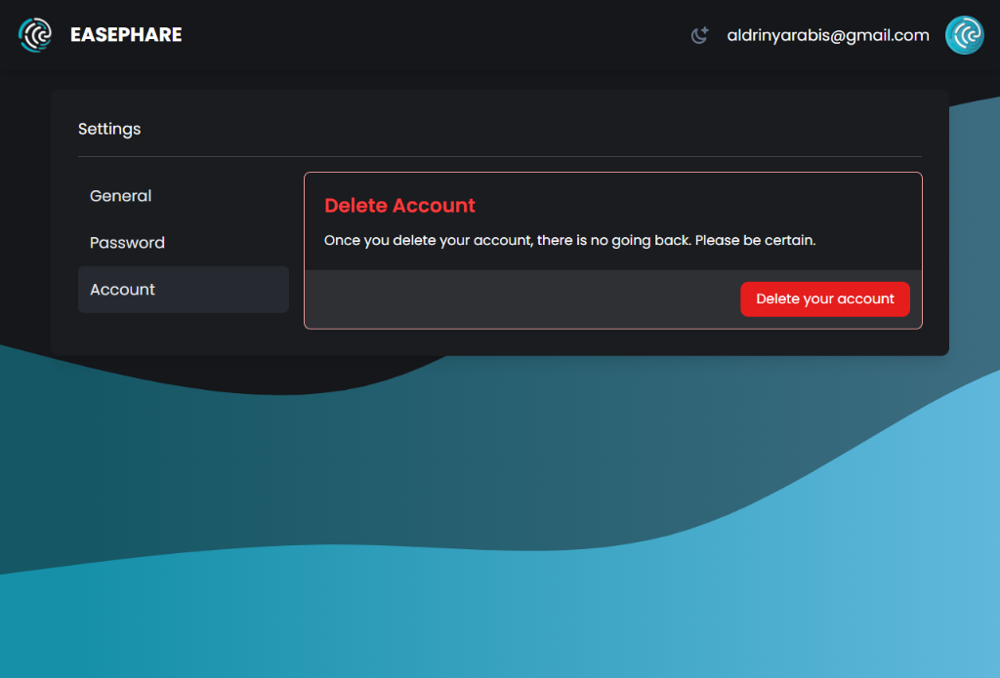

# Sveltekit-Supabase Auth Template


A web authentication template built with SvelteKit and Supabase, providing a seamless experience for user authentication, registration, and account management.

Live demo: https://sveltekit-supabase-auth-template.vercel.app/

## Features

- **User Authentication**: Enable users to log in securely with email and password.
- **User Registration**: Allow new users to register with a unique email and password combination.
- **Account Settings**: Empower users to manage their accounts with features such as changing passwords, uploading avatars, and deleting accounts.
- **Multi-level Modal System**: Implement a versatile modal system that supports multiple levels of modals for a flexible user interface.
- **Form Component with Zod Validation**: Utilize the Zod library for form validation, ensuring data integrity and a smooth user experience.

## Screenshots

 
 


## Getting Started

Follow these steps to get started with the Sveltekit-Supabase Auth Template:

1. **Clone the Repository:**
   ```bash
   git clone https://github.com/your-username/sveltekit-supabase-auth-template.git
   cd sveltekit-supabase-auth-template
   ```
